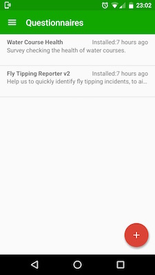

#Landscape Connect Android

Landscape Connect is a new way to gather responses to landscape based questionnaires. It supports grabbing of location and a photo as well as a fully customised questionnaire.

The questionnairecan be loaded in to the app from JSON and results are submitted using standard HTTP POST parameters.

The app defaults to the Landscape Connect server but can use any server by providing a full URL to download a valid questionnaire.

##Get
The app is live on Google Play. Search for 'Landscape Connect' or [click here](https://play.google.com/store/apps/details?id=uk.co.threeequals.landscapeconnect) to get the app.

##Installation
The Android code has been developed inside Android studio with Gradle. A Google API key will need to be grabbed to use the FusedLocationProvider service.

##Testing
ADB Monkey can be used to perform automated monkey testing on the app:
 `adb shell monkey -p uk.co.threeequals.landscapeconnect -v 15000`
 
 
Additionally MonkeyRunner can be used to take screenshots of the app:
`monkeyrunner screenshots.py `